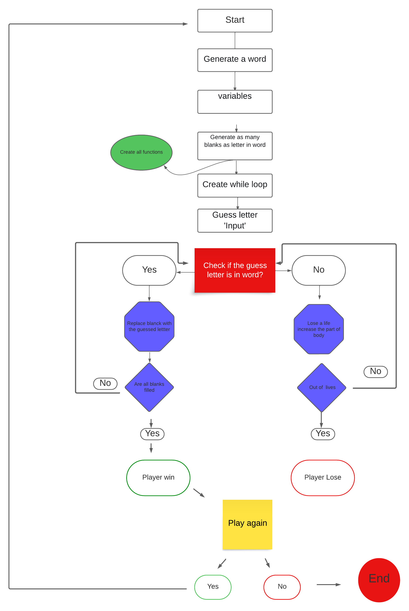
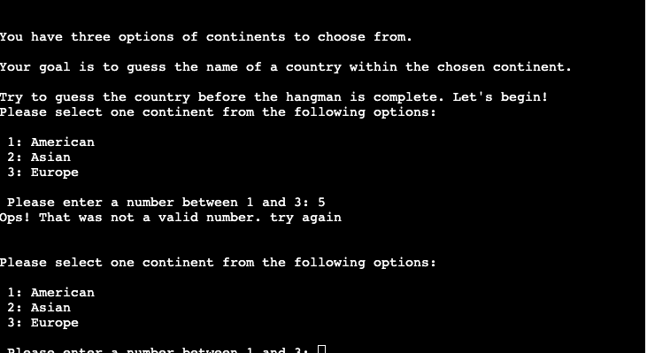
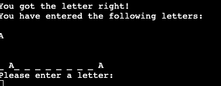

# PP3 Hangman Game

This is a Python terminal game of the classic Hangman game. The game allows players to guess letters to uncover a hidden word. The player has a limited number of attempts to guess the word correctly before losing the game.

## Table of Contents
- [How to play](#how-to-play)
- [Input validation and error-checking](#input-validation-and-error-checking)
- [Flowchart](#flowchart)
- [Features](#features)
- [Tools & Technologies Used](#tools--technologies-used)
- [Testing](#testing)
- [Deployment](#deployment)
  - [Steps for deployment](#steps-for-deployment)
  - [Cloning](#cloning)
- [Credits](#credits)

## How to play

- In this game, you will be presented with a series of randomly generated country names. However, as a player, you have the exciting opportunity to choose a continent from three options: America, Asia, and Europe. This means you can focus your knowledge and challenge yourself specifically within the chosen continent. Get ready to test your geography skills and explore the diverse countries of your selected continent!

1. Select a continent: The game will prompt you to choose a continent. Choose one from the available options (American, Asian, or Europe).

2. Guess the word: Once you've selected a continent, the game will generate a random word from that continent. You need to guess the letters of the word by entering them one at a time.

3. Correct guesses: If you guess a letter correctly, it will be revealed in the word. Keep guessing the remaining letters until you uncover the entire word.

4. Incorrect guesses: If you guess a letter that is not part of the word, the game will display a hangman stage. You have a total of 6 attempts before losing the game.

5. Win or lose: If you correctly guess all the letters in the word, you win the game. Congratulations! If you run out of attempts without guessing the word correctly, you lose the game.

6. Play again: After winning or losing, you have the option to play again. Choose 'Y' to start a new game or 'N' to exit.

### Input Validation and Error-Checking

#### Continent Selection:

- At the beginning of the game, the player is prompted to select a continent from three options: America, Asia, and Europe.
- To make a selection, the player must enter a number between 1 and 3.
- The game will continuously prompt the player until a valid input is provided.

#### Single Letter Input:

- When guessing letters, the player is required to input one letter at a time.
- If the player attempts to input more than one letter, they will be informed and prompted to try again.
- Only alphabetical characters are accepted; any other input is rejected.

#### Play Again Prompt:

- After winning or losing the game, the player is asked if they want to play again.
- To play again, the player needs to enter 'Y'; to exit, they should enter 'N'.
- The game will continue to prompt until a valid input ('Y' or 'N') is provided.

## Flowchart

## Features

To generate a random word, the player must choose from three continent options. The available choices are:
1. American
2. Asia
3. Europe

- If the player enters a letter or number that is not within the given options, they will be informed that their selection is incorrect. They will then be prompted to try again, this time choosing a number between 1 and 3.

- The player will be able to determine the number of letters in the word by observing the corresponding number of underscores (_). Additionally, the player can input the first letter of the word

- When the player correctly guesses a letter, both the letter itself and a message saying 'You got the letter right!' will be displayed.

- When the player types a wrong letter, a body part of the hangman will be revealed. They will have six opportunities to make mistakes, and if they exceed that limit, the game will end for the player.

- The player will win the game by typing all the letters correctly. However, if the player types letter incorrectly six times, they will lose the game.

- After the game is finished, a prompt will be displayed, asking the player if they would like to play again. The player can respond with 'Yes' to continue playing or 'No' to end the game.

## Tools & Technologies Used

- [Python](https://www.python.org/) was used to create this project.
- [Git](https://git-scm.com) used for version control. (`git add`, `git commit`, `git push`)
- [GitHub](https://github.com) used for secure online code storage.
- [Heroku](https://heroku.com) for deployment of the project.
- [CodeAnywhere](https://codeanywhere.com/) used as a cloud-based IDE for development.
- [Am I Responsive?](https://ui.dev/amiresponsive) used to show the website on a range of devices.

## Testing

[Testing](/TESTING.md) 

## Deployment

#### Steps for deployment

 - Fork or clone this repository
 - Create a new Heroku app
 - Set the buildbacks to Python and Nodsjs in that order
 - [Link](https://dashboard.heroku.com/apps/pp3-hangman-game-godinho/deploy/github) the Heruku app to the repository
 - Click on [Deploy](https://pp3-hangman-game-godinho-a0dc3a581f52.herokuapp.com/)

#### Cloning

You can clone the repository by following these steps:

1. Go to the [GitHub repository](https://github.com/Godinhoweverson/PP3_-Hangman_Game)
2. Locate the Code button above the list of files and click it
3. Select if you prefer to clone using HTTPS, SSH, or GitHub CLI and click the copy button to copy the URL to your clipboard
4. Open Git Bash or Terminal
5. Change the current working directory to the one where you want the cloned directory
6. In your IDE Terminal, type the following command to clone my repository:
	- `https://github.com/Godinhoweverson/PP3_-Hangman_Game.git`
7. Press Enter to create your local clone.

Alternatively, if using Codeanywhere, you can click below to create your own workspace using this repository.

[Open in Codeanywhere](https://app.codeanywhere.com/workspace/create#https://github.com/Godinhoweverson/PP3_-Hangman_Game)

 ### Credits

- Code Institute for the deployment terminal
- Wikipedia and youtube for the details of the Hangman game.
