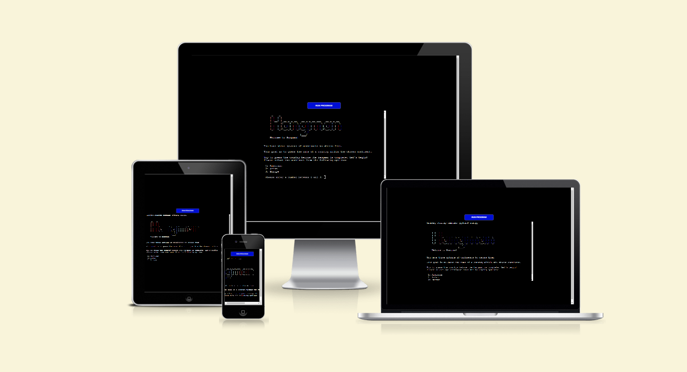
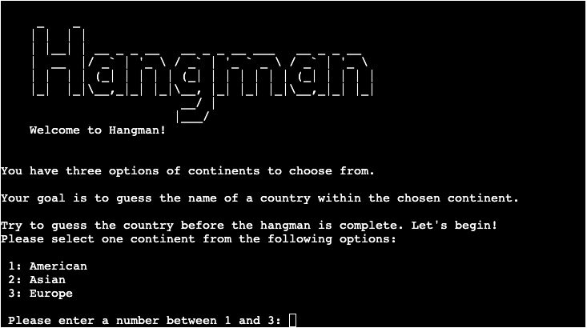

# PP3 Hangman Game

This is a Python terminal game of the classic Hangman game. The game allows players to guess letters to uncover a hidden word. The player has a limited number of attempts to guess the word correctly before losing the game.

## How to play

- In this game, you will be presented with a series of randomly generated country names. However, as a player, you have the exciting opportunity to choose a continent from three options: America, Asia, and Europe. This means you can focus your knowledge and challenge yourself specifically within the chosen continent. Get ready to test your geography skills and explore the diverse countries of your selected continent!

1. Select a continent: The game will prompt you to choose a continent. Choose one from the available options (American, Asian, or Europe).

2. Guess the word: Once you've selected a continent, the game will generate a random word from that continent. You need to guess the letters of the word by entering them one at a time.

3. Correct guesses: If you guess a letter correctly, it will be revealed in the word. Keep guessing the remaining letters until you uncover the entire word.

4. Incorrect guesses: If you guess a letter that is not part of the word, the game will display a hangman stage. You have a total of 6 attempts before losing the game.

5. Win or lose: If you correctly guess all the letters in the word, you win the game. Congratulations! If you run out of attempts without guessing the word correctly, you lose the game.

6. Play again: After winning or losing, you have the option to play again. Choose 'Y' to start a new game or 'N' to exit.

## Features

To generate a random word, the player must choose from three continent options. The available choices are:
1. American
2. Asia
3. Europe
If the player enters a letter or number that is not within the given options, they will be informed that their selection is incorrect. it will then be prompted to try again, this time choosing a number between 1 and 3.

## Reset buttom

- The reset button provides users with the ability to reset the game and start a new round without reloading the entire webpage. It enhances user engagement and encourages replayability by allowing users to quickly and conveniently continue playing the Rock-Paper-Scissors game.

## Message box

The message box serves as a visual indicator of the game outcome, providing users with immediate feedback on the result of their game round. Its clear presentation and distinct styling enhance the user experience by effectively communicating the outcome of the Rock-Paper-Scissors game.

## Images

- This section will showcase images of "rock, paper, scissors" for both the player and the computer. The player can choose their desired option, while the computer's choice will be randomized.

## Buttons rock, paper and scissors

- This interactive feature allows the player to actively participate by selecting their preferred move among the three buttons options. Whether they opt for the rock, paper, or scissors, the player's decision is captured when they click on the corresponding button.
  

## Scores
Keeps track of the results and displays the current score for the player and the computer in the game of rock, paper, scissors.

As the game progresses, each round's outcome, whether it's a win, loss, or draw, is recorded and reflected in the score section. Typically, the score section consists of separate counters or visual elements for the player's score and the computer's score.

For example, if the player wins a round, their score will increase by one, while the computer's score remains unchanged. Conversely, if the computer wins, its score increases, and the player's score stays the same. In the case of a draw, both scores may remain unchanged.

When the score reaches 3 for either the player or the computer, the game enters its final phase. At this point, a clear indication is displayed to notify the players that the game has concluded. This notification will be in the form of a message and background-color, red when the player lost game and green if win.

## Footer

The placement of the rules in the footer allows players to have a seamless and uninterrupted gaming experience while still being able to consult the rules whenever necessary. It enhances the usability and accessibility of the website, enabling players to enjoy the game while having the necessary information readily available.

## Tools & Technologies Used

- [HTML](https://en.wikipedia.org/wiki/HTML) used for the main site content.
- [CSS](https://en.wikipedia.org/wiki/CSS) used for the main site design and layout.
- [CSS Flexbox](https://www.w3schools.com/css/css3_flexbox.asp) used for an enhanced responsive layout.
- [JavaScript](https://en.wikipedia.org/wiki/JavaScript) Game functionality.
- [Git](https://git-scm.com) used for version control. (`git add`, `git commit`, `git push`)
- [GitHub](https://github.com) used for secure online code storage.
- [GitHub Pages](https://pages.github.com) used for hosting the deployed front-end site.
- [CodeAnywhere](https://codeanywhere.com/) used as a cloud-based IDE for development.
- [Am I Responsive?](https://ui.dev/amiresponsive) used to show the website on a range of devices.

## Testing

For all testing, please refer to the [TESTING.md](TESTING.md) file.

## Deployment

The site was deployed to GitHub Pages. The steps to deploy are as follows:

- In the [GitHub repository](https://github.com/Godinhoweverson/PP2-RPC-GAME), navigate to the Settings tab
- From the source section drop-down menu, select the **Main** Branch, then click "Save".
- The page will be automatically refreshed with a detailed ribbon display to indicate the successful deployment.

The live link can be found [here](https://godinhoweverson.github.io/PP2-RPC-GAME/)

### Local Deployment

This project can be cloned or forked in order to make a local copy on your own system.

#### Cloning

You can clone the repository by following these steps:

1. Go to the [GitHub repository](https://github.com/Godinhoweverson/PP2-RPC-GAME)
2. Locate the Code button above the list of files and click it
3. Select if you prefer to clone using HTTPS, SSH, or GitHub CLI and click the copy button to copy the URL to your clipboard
4. Open Git Bash or Terminal
5. Change the current working directory to the one where you want the cloned directory
6. In your IDE Terminal, type the following command to clone my repository:
	- `git clone https://github.com/Godinhoweverson/PP2-RPC-GAME.git`
7. Press Enter to create your local clone.

Alternatively, if using Gitpod, you can click below to create your own workspace using this repository.

[Open in Codeanywhere](https://app.codeanywhere.com/#https://github.com/Godinhoweverson/PP2-RPC-GAME)

#### Forking

By forking the GitHub Repository, we make a copy of the original repository on our GitHub account to view and/or make changes without affecting the original owner's repository.
You can fork this repository by using the following steps:

1. Log in to GitHub and locate the [GitHub Repository](https://github.com/Godinhoweverson/PP2-RPC-GAME)
2. At the top of the Repository (not top of page) just above the "Settings" Button on the menu, locate the "Fork" Button.
3. Once clicked, you should now have a copy of the original repository in your own GitHub account!

## Credits

### Content

 - [W3Schools](https://www.w3schools.com/howto/howto_js_topnav_responsive.asp)  responsive HTML/CSS
 - [Flexbox](https://css-tricks.com/snippets/css/a-guide-to-flexbox/) modern responsive layouts 
 - [Youtube](https://www.youtube.com/watch?v=2V7rfcVg5UQ&t=54s) | Document Object Model (DOM)  
 - [Mdn web docs](https://developer.mozilla.org/en-US/docs/Web/API/Document_Object_Model/Introduction)   Document Object Model (DOM)  

### Media

- [Pintrest](https://www.pinterest.ie/) Images 
- [Wikipedia](https://www.wikipedia.org/) Game rules

<!-- ### Acknowledgements

- I would like to thank the [Code Institute Slack community](https://code-institute-room.slack.com) for the technical support.
- I would like to thank my wife Deborah, for believing in me, and allowing me to make this transition into software development.   -->