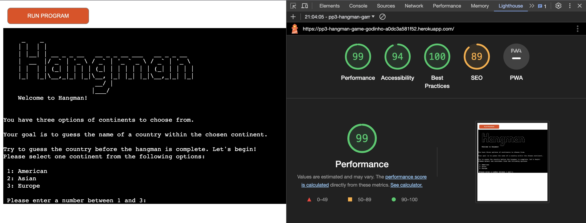
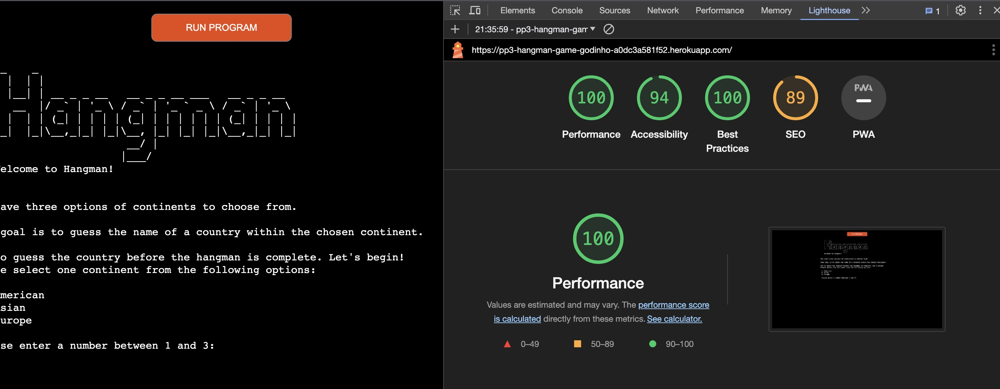
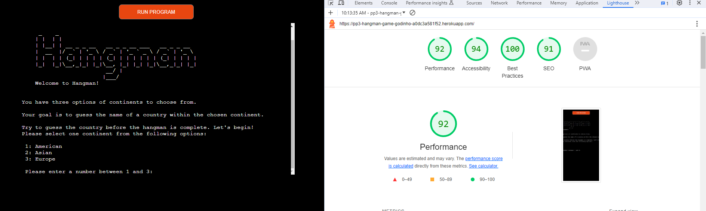
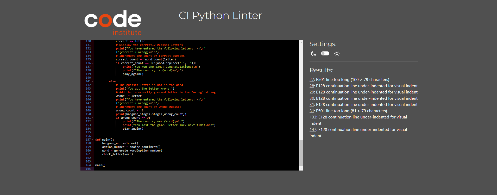
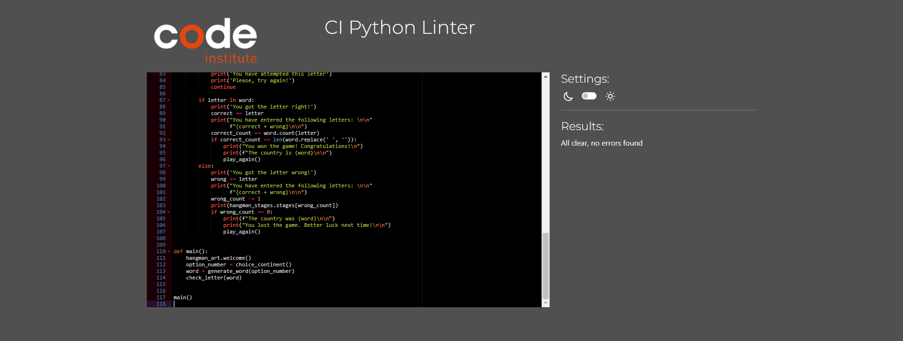
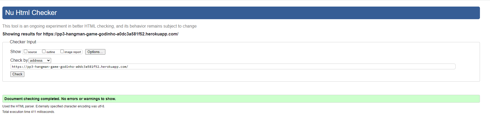
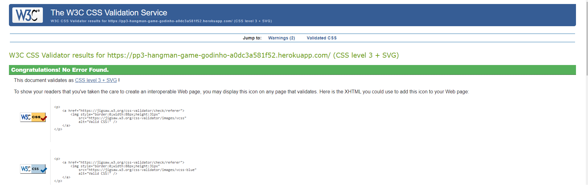
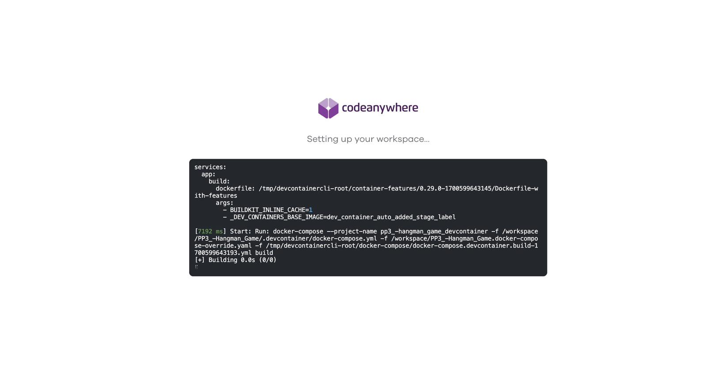

# Testing

## Manual Test

The testing phase for the Hangman game focused on ensuring the correctness and robustness of various functionalities. The objective was to thoroughly assess the program's behavior in response to user inputs, ensuring that it gracefully handles different scenarios and provides a positive gaming experience. The tests covered aspects such as continent selection, word generation, letter input, correct and incorrect letter guesses, game outcomes, play again functionality, general flow, and edge cases.

###  Test the continent selection

| Test |Result  |
|--|--|
|Run the program and choose each continent option (American, Asian, European).| Pass |
|Verify that the program accepts valid inputs (1, 2, 3) and rejects invalid inputs.| Pass|
|Confirm that the program loops until a valid input is provided.|Pass|

### Test word generation

| Test |Result  |
|--|--|
|After selecting a continent, check if the program generates a random country from the chosen continent.|Pass|
|Manually verify that the selected country is indeed from the correct continent.|Pass|
|Manually verify that the number of dashes matches how many letters are in the word.|Pass|

### Test letter input

| Test |Result  |
|--|--|
|Enter valid and invalid letters during the game.|Pass|
|Verify that the program only accepts a single letter at a time.|Pass|
|Check if the program rejects inputs of more than one letter.|Pass|
|Ensure that the program does not accept non-alphabetic characters.|Pass|

### Test correct letter guesses

| Test |Result  |
|--|--|
|Guess correct letters in the word.|Pass|
|Confirm that the program updates the display with the correctly guessed letters.|Pass|
|Verify that the correct letters are added to the 'correct' string.|Pass|
|Ensure that the program counts the correct guesses correctly.|Pass|

### Test incorrect letter guesses

| Test |Result  |
|--|--|
|Guess incorrect letters in the word.|Pass|
|Confirm that the program updates the display with hangman stages.|Pass|
|Verify that the incorrect letters are added to the 'wrong' string.|Pass|
|Ensure that the program counts the incorrect guesses correctly.|Pass|

### Test game outcomes
| Test |Result  |
|--|--|
|Play the game until you win, guessing all the words.|Pass|
|Verify that the program congratulates you and prompts if you want to play again.|Pass|
|Play the game until you lose, completing the body.|Pass|
|Verify that the program informs you of the correct country and asks if you want to play again.|Pass|

### Test play again functionality

| Test |Result  |
|--|--|
|Choose to play again after winning or losing.|Pass|
|Confirm that the program resets and starts a new game.|Pass|
|Choose not to play again after winning or losing.|Pass|
|Confirm that the program exits with a farewell message.|Pass|

### General Testing

| Test |Result  |
|--|--|
|Test the overall flow of the program by going through multiple rounds with different continents.|Pass|
|Confirm that the program handles user input gracefully and provides appropriate messages.|Pass|

### Edge Cases

| Test |Result  |
|--|--|
|Try entering non-numeric values when selecting a continent.|Pass|
|Attempt to guess the same letter multiple times.|Pass|
|Try guessing all letters to win the game.|Pass|
|Try guessing incorrect letters until you lose.|Pass|

## Conclusion

The manual testing of the Hangman game revealed that the program successfully meets its intended functionality. It accurately handles user inputs, generates random words from selected continents, and effectively manages correct and incorrect guesses. The user interface was found to be clear and informative, providing appropriate feedback throughout the game. The play again functionality resets the game state as expected, and the program gracefully handles various edge cases. Overall, the testing process ensures a reliable and enjoyable gaming experience for users interacting with the Hangman program.

## Accessibility

After conducting a Lighthouse test, the accessibility score was initially at 94%, with identified issues related to insufficient contrast ratios between background and foreground colors. Addressing this concern through adjustments to the background-color has led to a significant improvement, achieving a perfect accessibility score of 100 in the desktop test and maintaining 94 in the mobile test. Furthermore, these modifications have positively impacted performance, ultimately contributing to an overall enhanced user experience.

### Desktop

### Mobile

## Validation 

#### Python

##### Pep8

In the process of validating the Python code using the PEP8 validator, several issues were identified:

- Line Length Exceeded (E501):

- Line 27: The line exceeded the recommended maximum length of 79 characters.
Continuation Line Under-Indented for Visual Indent (E128):

- Lines 28-31, 133, and 147: The continuation lines were under-indented for visual clarity.

To address these issues, I have broken down the long lines into smaller, more readable segments and ensured proper indentation for continuation lines. This not only enhances code readability but also aligns with PEP8 conventions. The updated code now adheres to the recommended standards, promoting a cleaner and more consistent coding style.

#### HTML
HTML has been validated with [W3C HTML5 Validator](https://validator.w3.org/)

#### CSS
CSS has been validated with [W3C CSS Validator](https://jigsaw.w3.org/css-validator/)

## Bugs

#### play_again function
- In the play_again function, a bug was identified where, upon entering 'N' to close the game, the program would erroneously prompt the user twice. This issue has been successfully addressed in the updated code snippet below:

<strong>
if repeat_game == 'Y': 
    print("Let's start!\n") 
    main() 
    break 
elif repeat_game == 'N': 
    print("Thank you, see you next time!\n") 
    break
</strong>

The introduction of the break statement ensures the resolution of the problem, preventing the program from prompting the user multiple times when opting to close the game by typing 'N'. It is crucial to verify that this code snippet is embedded within an appropriate loop structure responsible for handling user input related to game repetition or closure.

#### Application Not Functioning Properly After Deployment
- After deploying the application, it was not functioning properly. Upon inspecting the logs, I identified the presence of ERROR H14. This error indicated that the Eco Dynos were not activated. To resolve this issue, I promptly activated the dynos, and the application resumed normal operation.

#### Unable to Create New Workspace Using CodeAnywhere
Upon attempting to create a new workspace using CodeAnywhere, the process failed, and I was unable to establish the desired workspace. After encountering this issue, I opted to switch to Gitpod, where I successfully created the workspace without any further impediments.

## Conclusion 

The extensive manual testing of the Hangman game has proven to be highly successful, affirming the robustness and reliability of the program. Each testing category, from continent selection to play again functionality, was meticulously examined, and the program consistently demonstrated its ability to handle various scenarios with precision and grace.
The program accurately generates random words from selected continents, efficiently manages correct and incorrect guesses, and provides a clear and informative user interface. The play again functionality resets the game state as expected, and the program exhibits resilience in handling edge cases, ensuring a seamless and enjoyable gaming experience.
Moreover, the accessibility improvements achieved through Lighthouse testing reflect a commitment to inclusivity, with a perfect score of 100 on desktop and a commendable 94 on mobile, demonstrating a user-centric approach.
The validation process, both for Python code and web technologies (HTML and CSS), reinforces adherence to best practices and standards, contributing to a clean and consistent codebase.
While addressing a minor bug in the play_again function, the program now ensures a smooth closure without redundant prompts, further enhancing the overall user experience.
In conclusion, the PP3 Hangman game has undergone rigorous testing, resulting in a well-crafted and dependable application that offers users an engaging and error-free gaming experience.

